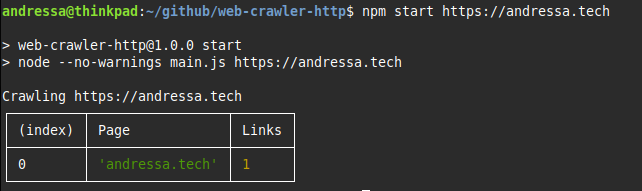

# web-crawler-http

A command line application that crawls a website and produces a report of the linking structure of the website.

---

## Prerequisites
- [Git](https://git-scm.com/downloads)
- [NVM](https://github.com/nvm-sh/nvm?tab=readme-ov-file#installing-and-updating)


## Installation

Clone the repository:

```shell
git clone git@github.com:ndressaa/web-crawler-http.git
```

Navigate to the folder:

```shell
cd web-crawler-http
```

Install and select node version from .nvmrc:

```shell
nvm install
nvm use
```

Install the dependencies:

```shell
npm install
```

## Usage

Run the application providing the website you want to crawl as a parameter:

```shell
npm start https://andressa.tech
```

### Output:



---

This project is part of a HTTP course available in:
https://www.youtube.com/watch?v=2JYT5f2isg4
